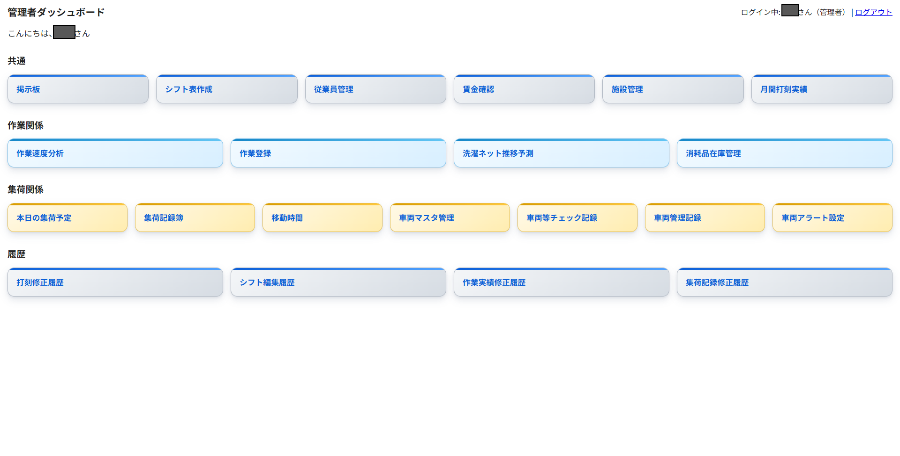
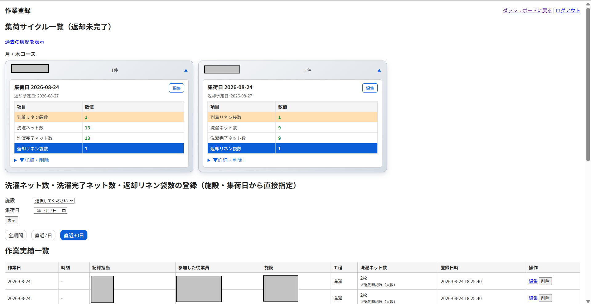
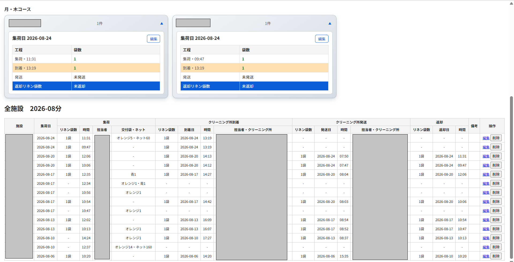
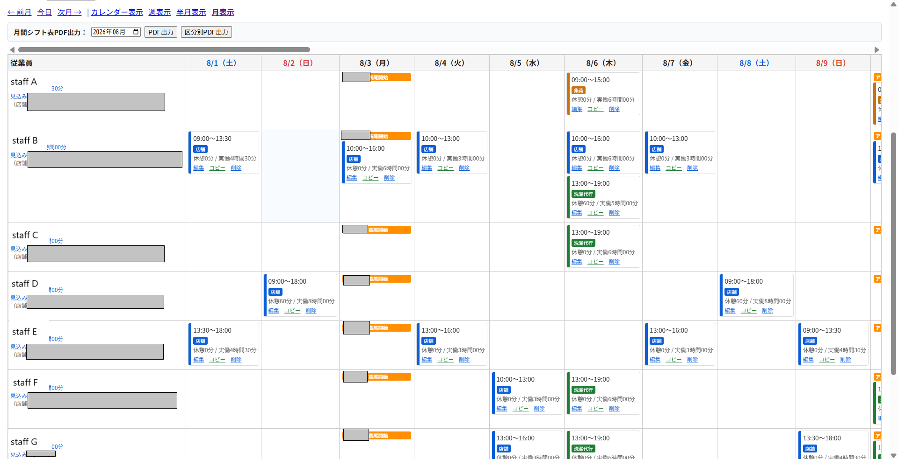
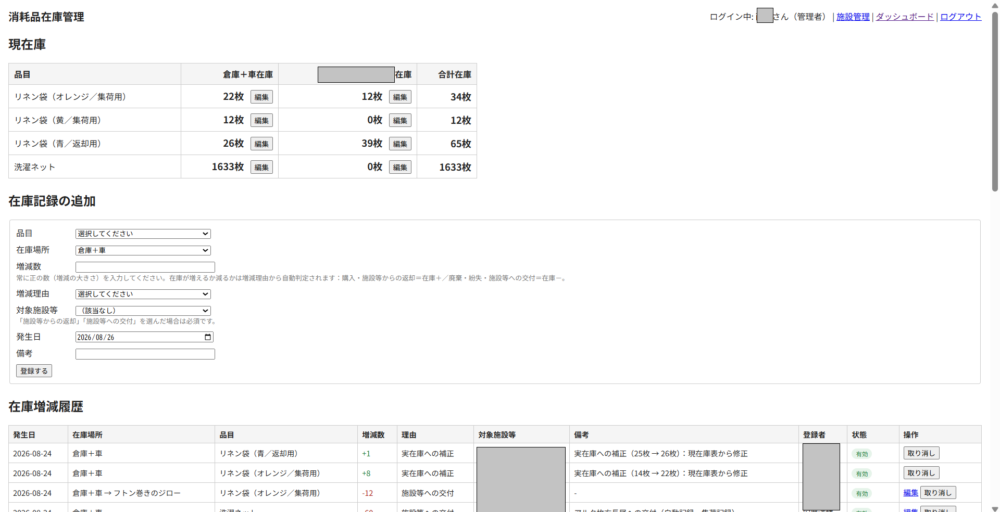

# CareWash Shift & Operations

**Open-source workforce and operations management for laundry, care-service, and field-service businesses.**

CareWash Shift & Operations is a PHP/MySQL web application built around real operational workflows: staff scheduling, attendance, payroll-related records, facility management, pickup and delivery, laundry workflow tracking, consumables inventory, and vehicle operations.

The project started as an internal operations tool and is being opened so that small businesses and developers can reuse, adapt, and improve it.

> Status: active development. Interfaces and database structures may still change.

## Screenshots

### Operations dashboard

A single dashboard provides access to workforce, laundry operations, pickup/delivery, inventory, and vehicle-management functions.



<table>
<tr>
<td width="50%">
<strong>Laundry workflow tracking</strong><br>
Track laundry processing by facility and pickup cycle, including wash progress and returned laundry nets.<br><br>

</td>
<td width="50%">
<strong>Pickup & delivery log</strong><br>
Track each service cycle from pickup through cleaning-site arrival, dispatch, and return.<br><br>

</td>
</tr>

<tr>
<td width="50%">
<strong>Shift management</strong><br>
Manage staff schedules across multiple work categories with monthly calendar views.<br><br>

</td>
<td width="50%">
<strong>Consumables inventory</strong><br>
Manage linen bags, laundry nets, stock locations, and inventory transaction history.<br><br>

</td>
</tr>
</table>

## Why this project exists

Small service businesses often run several operational processes at once:

- staff shifts and attendance
- multiple work categories and locations
- pickup/delivery routes
- customer or facility records
- work-stage tracking
- consumables and stock
- vehicle inspections and maintenance
- printable operational records

These workflows are usually split across spreadsheets, paper forms, chat, and several SaaS tools. This project aims to provide a practical, self-hosted foundation in one codebase.

## Current features

### Workforce
- Employee and administrator accounts
- Shift scheduling
- Staff calendar
- Attendance clock-in / clock-out
- Break tracking
- Attendance correction history
- Shift edit history
- Weekday / holiday wage settings
- Allowance and payroll-supporting records

### Operations
- Facility/customer management
- Pickup schedule management
- Pickup → arrival → dispatch → return cycle tracking
- Work-stage tracking for pickup, wash, dry, and fold
- Staff participation and productivity records
- Operational dashboards

### Inventory
- Laundry-net and linen-bag inventory
- Stock transactions
- Multiple stock locations
- Issue / return / disposal / loss / adjustment history

### Vehicle & field operations
- Vehicle master data
- Pre-departure inspection records
- Alcohol-check records
- Maintenance tracking
- Change history / audit records
- Travel-time related records

### Output & integration
- PDF generation using mPDF
- iCalendar (`.ics`) output for staff schedules

## Tech stack

- PHP
- MySQL / MariaDB-compatible database
- HTML / CSS / JavaScript
- Composer
- mPDF

The current deployment is Apache-oriented and includes `.htaccess` files.

## Repository structure

```text
.
├── admin/              # Administrator screens
├── staff/              # Staff-facing screens
├── includes/           # Shared authentication, DB and business logic
├── assets/             # Styles and image assets
├── sql/
│   ├── schema.sql      # Main database schema
│   └── migrate_*.sql   # Incremental migrations
├── calendar.ics.php    # Calendar feed endpoint
├── composer.json
├── config.sample.php
└── index.php
```

## Requirements

Recommended environment:

- PHP 8.x
- MySQL or MariaDB with InnoDB and `utf8mb4`
- Composer
- PHP extensions required by installed Composer packages, including `mbstring` and `gd`
- Apache or another web server configured for PHP

## Installation

### 1. Clone the repository

```bash
git clone https://github.com/onej22000/shift-carewash-net.git
cd shift-carewash-net
```

### 2. Install PHP dependencies

```bash
composer install
```

### 3. Create the database

Create an empty MySQL/MariaDB database, then import:

```bash
mysql -u YOUR_DB_USER -p YOUR_DB_NAME < sql/schema.sql
```

If you are upgrading an existing installation, review the dated migration files under `sql/` before applying them.

### 4. Create the local configuration

```bash
cp config.sample.php config.php
```

Edit `config.php` and set your own:

- database host
- database name
- database user
- database password
- business location, if location-aware features are used
- organization/site display names

`config.php` is intentionally excluded from Git.

### 5. Configure the web server

Point your PHP-capable web server at the repository directory and make sure PHP sessions and database access are available.

No production database dump, production credentials, or default administrator password should be committed to the repository.

## Configuration example

`config.sample.php` contains only placeholder values. Never commit your real `config.php`.

## Security

This project handles workforce and operational data. Before using it in production:

- use HTTPS
- use a dedicated database account with minimal privileges
- keep `config.php` outside version control
- restrict access to SQL and internal include directories
- keep PHP and Composer dependencies updated
- review authentication/session settings for your environment
- do not use real personal information in screenshots, issues, fixtures, or demo data

Please see [SECURITY.md](SECURITY.md) for vulnerability reporting guidance.

## Contributing

Contributions are welcome.

Good first contributions include:

- deployment documentation
- Docker/dev-environment support
- automated tests
- English UI/i18n
- accessibility improvements
- configuration cleanup
- modularization of business-specific workflows
- additional reporting/export formats

Please read [CONTRIBUTING.md](CONTRIBUTING.md) before opening a pull request.

## Project direction

The long-term goal is to separate reusable operations-management components from business-specific configuration so the project can serve a broader range of:

- laundries and cleaning businesses
- care-service support businesses
- delivery and pickup operations
- small field-service teams
- other multi-site service businesses

## License

The original source code in this repository is released under the MIT License. See [LICENSE](LICENSE).

Third-party packages are licensed separately. In particular, the currently locked mPDF package declares `GPL-2.0-only`. Review [THIRD_PARTY_NOTICES.md](THIRD_PARTY_NOTICES.md) and the Composer package licenses before redistributing a combined application.

Brand names, logos, and other trademark assets may have separate rights and are not granted for third-party branding use merely by this software license. Replace brand-specific assets when creating your own deployment.

## Maintainer

Maintained by [@onej22000](https://github.com/onej22000).

Issues and pull requests are welcome.
